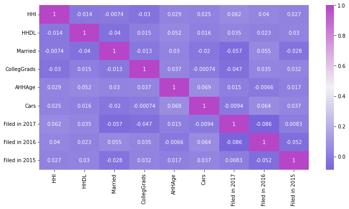

# Taxpayer

<b>About the Data</b>
<p>The dataset contains information about US taxpayers. There are 10 independent columns and 1 dependent column. This dataset includes attributes like household income, household debt level, if the taxpayer is married or not, how many cars their household has, if they filed their taxes in the last three years or not. </p>

<b>Data Description:</b>
<ul>
  <li>HHI: Household income</li>
  <li>HHDL: Household debt level</li>
  <li>Married: There are three categories for a taxpayer 0, 1, 2 with regards to marriage.</li>
  <li>PoliticalParty: Name of the political party</li>
  <li>CollegeGrads: Grade in College out of 5</li>
  <li>AHHAge: Average household age</li>
  <li>cars: number of cars in house</li>
  <li>Filed in YYYY: Tax filed in given year YYYY</li>
</ul>


## Import


```python
import matplotlib.pyplot as plt
import seaborn as sns
```

## Read Data


```python
import pandas as pd
tax_data  = pd.read_csv("https://raw.githubusercontent.com/dphi-official/Datasets/master/tax_payers/train_set_label.csv" )
test_data = pd.read_csv('https://raw.githubusercontent.com/dphi-official/Datasets/master/tax_payers/test_set_label.csv')
```


```python
tax_data.head()
```


<div>
<style scoped>
    .dataframe tbody tr th:only-of-type {
        vertical-align: middle;
    }

    .dataframe tbody tr th {
        vertical-align: top;
    }

    .dataframe thead th {
        text-align: right;
    }
</style>
<table border="1" class="dataframe">
  <thead>
    <tr style="text-align: right;">
      <th></th>
      <th>Unnamed: 0</th>
      <th>HHI</th>
      <th>HHDL</th>
      <th>Married</th>
      <th>CollegGrads</th>
      <th>AHHAge</th>
      <th>Cars</th>
      <th>Filed in 2017</th>
      <th>Filed in 2016</th>
      <th>Filed in 2015</th>
      <th>PoliticalParty</th>
    </tr>
  </thead>
  <tbody>
    <tr>
      <th>0</th>
      <td>61</td>
      <td>183414</td>
      <td>-12402</td>
      <td>1</td>
      <td>2</td>
      <td>28</td>
      <td>1</td>
      <td>0</td>
      <td>0</td>
      <td>1</td>
      <td>Democrat</td>
    </tr>
    <tr>
      <th>1</th>
      <td>501</td>
      <td>129786</td>
      <td>700251</td>
      <td>2</td>
      <td>5</td>
      <td>63</td>
      <td>3</td>
      <td>0</td>
      <td>0</td>
      <td>0</td>
      <td>Republican</td>
    </tr>
    <tr>
      <th>2</th>
      <td>658</td>
      <td>268343</td>
      <td>493411</td>
      <td>2</td>
      <td>4</td>
      <td>44</td>
      <td>1</td>
      <td>1</td>
      <td>0</td>
      <td>1</td>
      <td>Independent</td>
    </tr>
    <tr>
      <th>3</th>
      <td>703</td>
      <td>290506</td>
      <td>-433408</td>
      <td>1</td>
      <td>1</td>
      <td>28</td>
      <td>5</td>
      <td>1</td>
      <td>0</td>
      <td>1</td>
      <td>Republican</td>
    </tr>
    <tr>
      <th>4</th>
      <td>702</td>
      <td>90108</td>
      <td>907135</td>
      <td>1</td>
      <td>3</td>
      <td>57</td>
      <td>5</td>
      <td>1</td>
      <td>1</td>
      <td>0</td>
      <td>Democrat</td>
    </tr>
  </tbody>
</table>
</div>


```python
test_data.head()
```


<div>
<style scoped>
    .dataframe tbody tr th:only-of-type {
        vertical-align: middle;
    }

    .dataframe tbody tr th {
        vertical-align: top;
    }

    .dataframe thead th {
        text-align: right;
    }
</style>
<table border="1" class="dataframe">
  <thead>
    <tr style="text-align: right;">
      <th></th>
      <th>Unnamed: 0</th>
      <th>HHI</th>
      <th>HHDL</th>
      <th>Married</th>
      <th>CollegGrads</th>
      <th>AHHAge</th>
      <th>Cars</th>
      <th>Filed in 2017</th>
      <th>Filed in 2016</th>
      <th>Filed in 2015</th>
    </tr>
  </thead>
  <tbody>
    <tr>
      <th>0</th>
      <td>17</td>
      <td>253274</td>
      <td>-633752</td>
      <td>2</td>
      <td>1</td>
      <td>94</td>
      <td>3</td>
      <td>0</td>
      <td>1</td>
      <td>1</td>
    </tr>
    <tr>
      <th>1</th>
      <td>590</td>
      <td>47107</td>
      <td>322850</td>
      <td>0</td>
      <td>1</td>
      <td>30</td>
      <td>2</td>
      <td>1</td>
      <td>1</td>
      <td>0</td>
    </tr>
    <tr>
      <th>2</th>
      <td>224</td>
      <td>111874</td>
      <td>300583</td>
      <td>0</td>
      <td>2</td>
      <td>46</td>
      <td>3</td>
      <td>0</td>
      <td>1</td>
      <td>1</td>
    </tr>
    <tr>
      <th>3</th>
      <td>960</td>
      <td>96670</td>
      <td>107419</td>
      <td>0</td>
      <td>3</td>
      <td>77</td>
      <td>5</td>
      <td>0</td>
      <td>0</td>
      <td>0</td>
    </tr>
    <tr>
      <th>4</th>
      <td>57</td>
      <td>128669</td>
      <td>341273</td>
      <td>0</td>
      <td>0</td>
      <td>92</td>
      <td>4</td>
      <td>1</td>
      <td>1</td>
      <td>1</td>
    </tr>
  </tbody>
</table>
</div>


```python
tax_data.info()
```

    <class 'pandas.core.frame.DataFrame'>
    RangeIndex: 803 entries, 0 to 802
    Data columns (total 11 columns):
     #   Column          Non-Null Count  Dtype 
    ---  ------          --------------  ----- 
     0   Unnamed: 0      803 non-null    int64 
     1   HHI             803 non-null    int64 
     2   HHDL            803 non-null    int64 
     3   Married         803 non-null    int64 
     4   CollegGrads     803 non-null    int64 
     5   AHHAge          803 non-null    int64 
     6   Cars            803 non-null    int64 
     7   Filed in 2017   803 non-null    int64 
     8   Filed in 2016   803 non-null    int64 
     9   Filed in 2015   803 non-null    int64 
     10  PoliticalParty  803 non-null    object
    dtypes: int64(10), object(1)
    memory usage: 69.1+ KB
    


```python
tax_data.drop("Unnamed: 0", axis=1, inplace=True)
```


```python
tax_data.info()
```

    <class 'pandas.core.frame.DataFrame'>
    RangeIndex: 803 entries, 0 to 802
    Data columns (total 10 columns):
     #   Column          Non-Null Count  Dtype 
    ---  ------          --------------  ----- 
     0   HHI             803 non-null    int64 
     1   HHDL            803 non-null    int64 
     2   Married         803 non-null    int64 
     3   CollegGrads     803 non-null    int64 
     4   AHHAge          803 non-null    int64 
     5   Cars            803 non-null    int64 
     6   Filed in 2017   803 non-null    int64 
     7   Filed in 2016   803 non-null    int64 
     8   Filed in 2015   803 non-null    int64 
     9   PoliticalParty  803 non-null    object
    dtypes: int64(9), object(1)
    memory usage: 62.9+ KB
    


```python
tax_data.PoliticalParty.value_counts()
```


    Democrat       269
    Independent    269
    Republican     265
    Name: PoliticalParty, dtype: int64


```python
color = sns.diverging_palette(270, 300, as_cmap = True)
plt.figure(figsize=(12,6))
sns.heatmap(tax_data.corr(), cmap=color, annot=True)
```


    <AxesSubplot:>


    

    


## Spliting Data 


```python
x = tax_data.iloc[:,0:9]
y = tax_data['PoliticalParty']
```


```python
x.head()
```


<div>
<style scoped>
    .dataframe tbody tr th:only-of-type {
        vertical-align: middle;
    }

    .dataframe tbody tr th {
        vertical-align: top;
    }

    .dataframe thead th {
        text-align: right;
    }
</style>
<table border="1" class="dataframe">
  <thead>
    <tr style="text-align: right;">
      <th></th>
      <th>HHI</th>
      <th>HHDL</th>
      <th>Married</th>
      <th>CollegGrads</th>
      <th>AHHAge</th>
      <th>Cars</th>
      <th>Filed in 2017</th>
      <th>Filed in 2016</th>
      <th>Filed in 2015</th>
    </tr>
  </thead>
  <tbody>
    <tr>
      <th>0</th>
      <td>183414</td>
      <td>-12402</td>
      <td>1</td>
      <td>2</td>
      <td>28</td>
      <td>1</td>
      <td>0</td>
      <td>0</td>
      <td>1</td>
    </tr>
    <tr>
      <th>1</th>
      <td>129786</td>
      <td>700251</td>
      <td>2</td>
      <td>5</td>
      <td>63</td>
      <td>3</td>
      <td>0</td>
      <td>0</td>
      <td>0</td>
    </tr>
    <tr>
      <th>2</th>
      <td>268343</td>
      <td>493411</td>
      <td>2</td>
      <td>4</td>
      <td>44</td>
      <td>1</td>
      <td>1</td>
      <td>0</td>
      <td>1</td>
    </tr>
    <tr>
      <th>3</th>
      <td>290506</td>
      <td>-433408</td>
      <td>1</td>
      <td>1</td>
      <td>28</td>
      <td>5</td>
      <td>1</td>
      <td>0</td>
      <td>1</td>
    </tr>
    <tr>
      <th>4</th>
      <td>90108</td>
      <td>907135</td>
      <td>1</td>
      <td>3</td>
      <td>57</td>
      <td>5</td>
      <td>1</td>
      <td>1</td>
      <td>0</td>
    </tr>
  </tbody>
</table>
</div>


```python
y.head()
```


    0       Democrat
    1     Republican
    2    Independent
    3     Republican
    4       Democrat
    Name: PoliticalParty, dtype: object


```python
from sklearn.model_selection import train_test_split
x_train, x_test, y_train, y_test = train_test_split(x,y, test_size=0.2, random_state=1, stratify=y)
```


```python
from sklearn.ensemble import RandomForestClassifier
forest = RandomForestClassifier(random_state=1, n_estimators=10, max_depth = 5, n_jobs=-1)
```

## Random Forest 


```python
forest.fit(x_train, y_train)
```


    RandomForestClassifier(max_depth=5, n_estimators=10, n_jobs=-1, random_state=1)


```python
forest.predict(x_test)
```


    array(['Republican', 'Republican', 'Independent', 'Republican',
           'Republican', 'Democrat', 'Democrat', 'Independent', 'Democrat',
           'Republican', 'Democrat', 'Democrat', 'Independent', 'Republican',
           'Democrat', 'Republican', 'Republican', 'Independent',
           'Independent', 'Democrat', 'Independent', 'Independent',
           'Republican', 'Independent', 'Republican', 'Democrat', 'Democrat',
           'Democrat', 'Independent', 'Independent', 'Republican', 'Democrat',
           'Democrat', 'Democrat', 'Democrat', 'Independent', 'Independent',
           'Independent', 'Democrat', 'Independent', 'Independent',
           'Independent', 'Independent', 'Republican', 'Republican',
           'Republican', 'Democrat', 'Independent', 'Democrat', 'Independent',
           'Democrat', 'Independent', 'Independent', 'Democrat', 'Republican',
           'Democrat', 'Republican', 'Republican', 'Democrat', 'Republican',
           'Independent', 'Democrat', 'Republican', 'Independent', 'Democrat',
           'Independent', 'Republican', 'Democrat', 'Democrat', 'Republican',
           'Democrat', 'Independent', 'Republican', 'Republican', 'Democrat',
           'Independent', 'Republican', 'Independent', 'Democrat',
           'Independent', 'Democrat', 'Democrat', 'Democrat', 'Democrat',
           'Independent', 'Democrat', 'Republican', 'Independent',
           'Independent', 'Independent', 'Republican', 'Independent',
           'Democrat', 'Democrat', 'Democrat', 'Independent', 'Democrat',
           'Democrat', 'Independent', 'Democrat', 'Independent', 'Republican',
           'Democrat', 'Democrat', 'Democrat', 'Independent', 'Democrat',
           'Republican', 'Independent', 'Democrat', 'Democrat', 'Democrat',
           'Democrat', 'Democrat', 'Independent', 'Democrat', 'Independent',
           'Republican', 'Democrat', 'Democrat', 'Democrat', 'Independent',
           'Democrat', 'Republican', 'Democrat', 'Independent', 'Independent',
           'Independent', 'Democrat', 'Democrat', 'Democrat', 'Republican',
           'Republican', 'Independent', 'Republican', 'Republican',
           'Independent', 'Democrat', 'Republican', 'Independent',
           'Independent', 'Democrat', 'Democrat', 'Democrat', 'Democrat',
           'Independent', 'Democrat', 'Independent', 'Democrat', 'Republican',
           'Republican', 'Independent', 'Independent', 'Democrat', 'Democrat',
           'Republican', 'Republican', 'Democrat', 'Independent', 'Democrat',
           'Independent'], dtype=object)


```python
forest.score(x_train, y_train)
```


    0.6214953271028038


```python
forest.score(x_test, y_test)
```


    0.36645962732919257


## Testing Data


```python
test_data.drop("Unnamed: 0", axis=1, inplace=True)
```


```python
test_data.head()
```


<div>
<style scoped>
    .dataframe tbody tr th:only-of-type {
        vertical-align: middle;
    }

    .dataframe tbody tr th {
        vertical-align: top;
    }

    .dataframe thead th {
        text-align: right;
    }
</style>
<table border="1" class="dataframe">
  <thead>
    <tr style="text-align: right;">
      <th></th>
      <th>HHI</th>
      <th>HHDL</th>
      <th>Married</th>
      <th>CollegGrads</th>
      <th>AHHAge</th>
      <th>Cars</th>
      <th>Filed in 2017</th>
      <th>Filed in 2016</th>
      <th>Filed in 2015</th>
    </tr>
  </thead>
  <tbody>
    <tr>
      <th>0</th>
      <td>253274</td>
      <td>-633752</td>
      <td>2</td>
      <td>1</td>
      <td>94</td>
      <td>3</td>
      <td>0</td>
      <td>1</td>
      <td>1</td>
    </tr>
    <tr>
      <th>1</th>
      <td>47107</td>
      <td>322850</td>
      <td>0</td>
      <td>1</td>
      <td>30</td>
      <td>2</td>
      <td>1</td>
      <td>1</td>
      <td>0</td>
    </tr>
    <tr>
      <th>2</th>
      <td>111874</td>
      <td>300583</td>
      <td>0</td>
      <td>2</td>
      <td>46</td>
      <td>3</td>
      <td>0</td>
      <td>1</td>
      <td>1</td>
    </tr>
    <tr>
      <th>3</th>
      <td>96670</td>
      <td>107419</td>
      <td>0</td>
      <td>3</td>
      <td>77</td>
      <td>5</td>
      <td>0</td>
      <td>0</td>
      <td>0</td>
    </tr>
    <tr>
      <th>4</th>
      <td>128669</td>
      <td>341273</td>
      <td>0</td>
      <td>0</td>
      <td>92</td>
      <td>4</td>
      <td>1</td>
      <td>1</td>
      <td>1</td>
    </tr>
  </tbody>
</table>
</div>


```python
target = forest.predict(test_data)
res = pd.DataFrame(target)
res.index = test_data.index
res.columns = ["prediction"]
res.to_csv("prediction_results.csv", index=False)
```


```python

```
